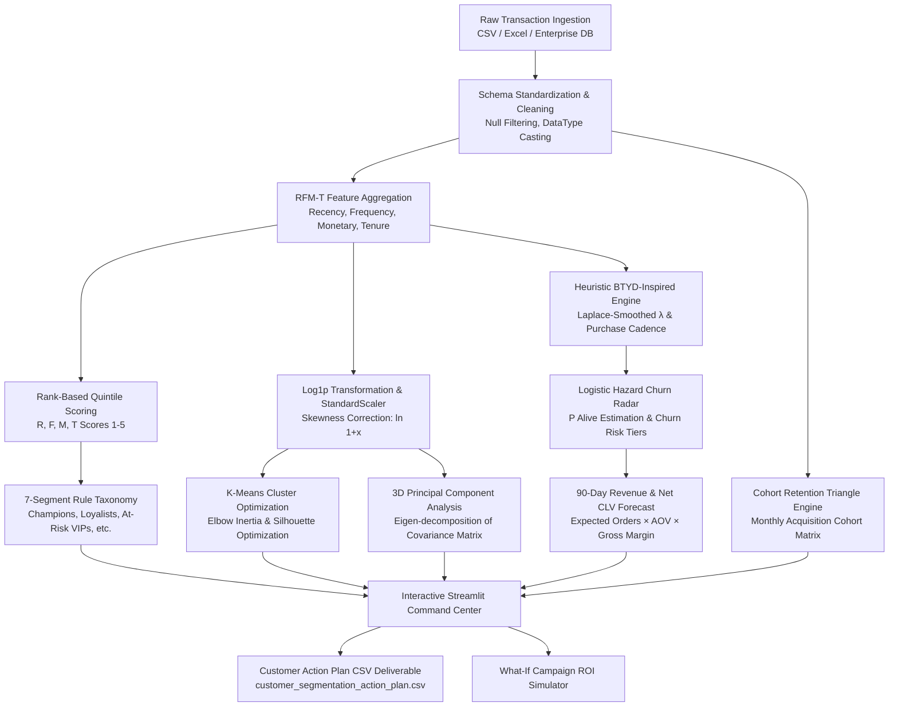

# 🎯 Enterprise Customer RFM-T & AI Segmentation Platform

[](https://www.python.org/)
[](https://streamlit.io/)
[](https://scikit-learn.org/)
[](https://plotly.com/)
[](LICENSE)
[](https://github.com/shambo1597-afk/rfm-customer-intelligence-engine/actions/workflows/test.yml)

An enterprise-grade, end-to-end customer intelligence platform designed to transform raw e-commerce transaction logs into high-precision behavioral segments, forward-looking lifetime value (CLV) forecasts, automated churn alerts, and data-driven marketing playbooks.

---

## 📑 Table of Contents
1. [Executive Summary & Core Capabilities](#-executive-summary--core-capabilities)
2. [End-to-End System Architecture](#-end-to-end-system-architecture)
3. [Mathematical Foundations & Algorithmic Formulations](#-mathematical-foundations--algorithmic-formulations)
   - [RFM-T Feature Engineering & Quintile Scoring](#1-rfm-t-feature-engineering--quintile-scoring)
   - [Feature Preprocessing & Skewness Mitigation](#2-feature-preprocessing--skewness-mitigation)
   - [Unsupervised Machine Learning: K-Means Clustering](#3-unsupervised-machine-learning-k-means-clustering)
   - [ML Cluster vs. Segment Agreement: What the Clustering Step Is Actually For](#ml-cluster-vs-segment-agreement-what-the-clustering-step-is-actually-for)
   - [Dimensionality Reduction: 3D Principal Component Analysis (PCA)](#4-dimensionality-reduction-3d-principal-component-analysis-pca)
   - [Heuristic Churn-Hazard Model (BTYD-Inspired) CLV & Churn Radar](#5-heuristic-churn-hazard-model-btyd-inspired-clv--churn-radar)
   - [Configuring the Churn Hazard Model](#-configuring-the-churn-hazard-model)
   - [Monthly Acquisition Cohort Retention Triangle](#6-monthly-acquisition-cohort-retention-triangle)
4. [Enterprise 7-Segment Taxonomy & Marketing Playbooks](#-enterprise-7-segment-taxonomy--marketing-playbooks)
5. [What-If Campaign ROI Simulation Framework](#-what-if-campaign-roi-simulation-framework)
6. [Interactive Streamlit Command Center Overview](#-interactive-streamlit-command-center-overview)
7. [Repository Structure](#-repository-structure)
8. [Data Dictionary & Output Deliverables](#-data-dictionary--output-deliverables)
9. [Installation & Quickstart Guide](#-installation--quickstart-guide)
10. [Connecting a Shopify Store](#-connecting-a-shopify-store)
11. [AI Executive Summary (Optional)](#-ai-executive-summary-optional)
12. [Chat Q&A (Optional)](#-chat-qa-optional)
13. [AI Budget Advisor (Optional)](#-ai-budget-advisor-optional)
14. [Cohort Pattern Narration (Optional)](#-cohort-pattern-narration-optional)
15. [Automated Testing Suite](#-automated-testing-suite)
16. [Model Validation & Backtest Results](#-model-validation--backtest-results)
17. [Strategic Business Use Cases](#-strategic-business-use-cases)

---

## 🌟 Executive Summary & Core Capabilities

Modern customer retention requires moving beyond static, backward-looking metrics toward predictive customer modeling. This platform integrates **deterministic behavioral scoring (RFM-T)** with **unsupervised machine learning (K-Means + 3D PCA)** and a **heuristic, BTYD-inspired churn-hazard model (CLV & Churn Radar)** to provide a 360-degree view of customer health.

The K-Means/PCA path and the rule-based 7-segment taxonomy are two independently-computed views of the same customers — a hand-tuned rule system and an unsupervised one. They are cross-checked against each other (not merged into a single output) via the Segment × ML Cluster agreement matrix in the "Unsupervised ML Clustering" tab: where the two disagree substantially, that's a signal the quintile-rule thresholds may need revisiting, and it's also a sanity check against clusters that are just an artifact of K-Means (see [below](#ml-cluster-vs-segment-agreement-what-the-clustering-step-is-actually-for) for what this is and isn't used for).

```
┌────────────────────────────────────────────────────────────────────────────────────────┐
│                               CORE PLATFORM CAPABILITIES                               │
├──────────────────────────┬──────────────────────────┬──────────────────────────────────┤
│ 📐 RFM-T Scoring Engine  │ 🤖 Unsupervised ML & 3D  │ 🔮 Predictive CLV & Churn Radar  │
│ 1-5 rank quintiles for   │ Log-transform, Standard- │ Laplace-smoothed rates,          │
│ Recency, Frequency,      │ Scaler, Elbow/Silhouette │ logistic hazard decay,           │
│ Monetary, & Tenure with  │ optimization, and 3D     │ P(Alive) estimation, and 90-day  │
│ 7-segment taxonomy.      │ spatial PCA projection.  │ forward revenue forecasting.     │
├──────────────────────────┼──────────────────────────┼──────────────────────────────────┤
│ 📊 Retention Triangles   │ 🎯 Marketing Playbooks   │ 💼 Financial ROI Simulator       │
│ Triangular cohort matrix │ Automated channel, promo │ What-if campaign modeling        │
│ tracking 24 months of    │ copy, and strategic      │ calculating projected revenue,   │
│ retention decay curves.  │ intervention tactics.    │ net profit, and acquisition CPA. │
└──────────────────────────┴──────────────────────────┴──────────────────────────────────┘
```

---

## 🏗️ End-to-End System Architecture

The pipeline processes raw transactions through multiple mathematical transformations before feeding the analytics dashboards and exportable deliverables:



---

## 🧮 Mathematical Foundations & Algorithmic Formulations

### 1. RFM-T Feature Engineering & Quintile Scoring

For each individual customer $i \in \{1, 2, \dots, N\}$, the transaction history spanning the observation window $[t_0, t_{\text{snapshot}}]$ is collapsed into four core dimensions:

$$\text{Recency } (R_i) = \left\lfloor \frac{t_{\text{snapshot}} - \max(t_{i, j})}{86400} \right\rfloor \quad \text{[Days since last transaction]}$$

$$\text{Frequency } (F_i) = \left| \bigcup_{j} \text{InvoiceNo}_{i, j} \right| \quad \text{[Count of unique purchase orders]}$$

$$\text{Monetary } (M_i) = \sum_{j=1}^{F_i} \text{OrderSpend}_{i, j} \quad \text{[Total gross realized spend (\$)]}$$

$$\text{Tenure } (T_i) = \left\lfloor \frac{t_{\text{snapshot}} - \min(t_{i, j})}{86400} \right\rfloor \quad \text{[Days since initial customer acquisition]}$$

$$\text{Average Order Value } (\text{AOV}_i) = \frac{M_i}{\max(F_i, 1)}$$

#### Quintile Discretization ($1 \text{ to } 5$ Scoring)
To eliminate scale sensitivity and avoid non-unique bin edge collisions, the platform applies **rank-based quantile discretization**:

$$S_R(i) = \text{qcut}\left( \text{rank}(-R_i, \text{method='first'}), 5 \right) \in \{1, 2, 3, 4, 5\}$$

$$S_F(i) = \text{qcut}\left( \text{rank}(F_i, \text{method='first'}), 5 \right) \in \{1, 2, 3, 4, 5\}$$

$$S_M(i) = \text{qcut}\left( \text{rank}(M_i, \text{method='first'}), 5 \right) \in \{1, 2, 3, 4, 5\}$$

$$S_T(i) = \text{qcut}\left( \text{rank}(T_i, \text{method='first'}), 5 \right) \in \{1, 2, 3, 4, 5\}$$

*Note: For Recency, lower elapsed days yield a higher score ($5 = \text{most recent}$). For Frequency, Monetary, and Tenure, higher values yield higher scores ($5 = \text{highest magnitude}$).*

$$\text{Composite RFM Score} = S_R \cdot 100 + S_F \cdot 10 + S_M \quad \text{(e.g., '555', '155', '511')}$$

$$\text{RFM-T Mean} = \frac{S_R + S_F + S_M + S_T}{4}$$

---

### 2. Feature Preprocessing & Skewness Mitigation

E-commerce transaction distributions exhibit extreme positive skewness (long tails governed by Pareto distributions). Feeding raw monetary or frequency values into Euclidean distance-based clustering algorithms distorts centroid calculations.

1. **Logarithmic Transformation**:
   $$\tilde{x}_{i, k} = \ln(1 + x_{i, k}) \quad \forall k \in \{R, F, M, T\}$$

2. **Z-Score Standardization**:
   $$z_{i, k} = \frac{\tilde{x}_{i, k} - \mu_k}{\sigma_k}, \quad \text{where } \mu_k = \frac{1}{N}\sum_{i=1}^N \tilde{x}_{i, k}, \quad \sigma_k = \sqrt{\frac{1}{N}\sum_{i=1}^N (\tilde{x}_{i, k} - \mu_k)^2}$$

---

### 3. Unsupervised Machine Learning: K-Means Clustering

K-Means partitions the normalized $d$-dimensional space $\mathbf{Z} \in \mathbb{R}^{N \times 4}$ into $K$ disjoint clusters $\mathcal{C} = \{C_1, C_2, \dots, C_K\}$ by minimizing the **Within-Cluster Sum of Squares (Inertia)**:

$$\mathcal{J}(K) = \sum_{k=1}^K \sum_{\mathbf{z}_i \in C_k} \left\| \mathbf{z}_i - \boldsymbol{\mu}_k \right\|_2^2, \quad \text{where } \boldsymbol{\mu}_k = \frac{1}{|C_k|}\sum_{\mathbf{z}_i \in C_k} \mathbf{z}_i$$

#### Cluster Optimization: Silhouette Coefficient
For candidate cluster counts $k \in [2, 7]$, the algorithm evaluates cluster cohesion and separation:

$$s(i) = \frac{b(i) - a(i)}{\max\left(a(i), b(i)\right)}$$

Where:
- $a(i) = \frac{1}{|C_I| - 1} \sum_{j \in C_I, j \neq i} \|\mathbf{z}_i - \mathbf{z}_j\|$ (mean intra-cluster distance)
- $b(i) = \min_{J \neq I} \frac{1}{|C_J|} \sum_{j \in C_J} \|\mathbf{z}_i - \mathbf{z}_j\|$ (mean nearest-cluster distance)

$$\text{Optimal } K^* = \arg\max_{k \in [2, 7]} \left( \frac{1}{N}\sum_{i=1}^N s(i) \right)$$

### ML Cluster vs. Segment Agreement: What the Clustering Step Is Actually For

K-Means and the 7-segment rule taxonomy ([§4 below](#-enterprise-7-segment-taxonomy--marketing-playbooks)) are computed **completely independently**: the rules have no knowledge of the clustering, and K-Means has no knowledge of the rules. Left at that, `ML_Cluster` would just be parallel decoration — a label every customer gets that nothing else in the platform reads.

Instead, `compute_segment_cluster_crosstab()` (`src/ml_engine.py`) cross-tabulates the two, and the **"Unsupervised ML Clustering"** tab surfaces it as a heatmap (`Segment` rows, each normalized to 100% of that segment's customers, `ML_Cluster` columns). This is a validation tool, not a merge into a new label:

- **Segments landing overwhelmingly in one cluster** corroborate the rule-based thresholds — the hand-picked RFM-T quintile cutoffs and the unsupervised algorithm agree there's a real behavioral grouping there.
- **Segments that split across multiple clusters** are a concrete signal that a quintile boundary may be cutting across a natural grouping rather than following one, and are worth revisiting.

On the bundled synthetic dataset ($k=3$, via `python generate_action_plan.py`), most segments agree strongly with one cluster (Champions, Can't Lose Them: 100%; At-Risk VIPs: 99%; New Customers: 100% — each landing almost entirely in a single cluster) — but **Potential Growth splits 38% / 62%** across two clusters, and **Hibernating splits 22% / 76% / 2%** across all three. That's the crosstab doing its job: it's telling you those two segments' quintile cutoffs cut across boundaries K-Means finds naturally, which is exactly the kind of thing worth investigating before trusting those segments' marketing playbooks at face value. Re-run `python generate_action_plan.py` for the current numbers on your data — they will differ from a synthetic-data snapshot.

**Scope, stated explicitly rather than left ambiguous:** this crosstab is a model-validation tool for the analyst or data-science reviewer of this product — it answers "does the unsupervised clustering corroborate the hand-picked segment thresholds, or suggest one needs revisiting?" It is **not** a customer-facing decision input: `ML_Cluster` does not currently modulate the `Segment` label, the Urgent Churn Watchlist's ranking, or any other customer-facing output anywhere in this platform. That is a deliberate scope boundary for this version, not an unfinished feature — actually using the crosstab's signal to re-threshold a segment or re-prioritize the watchlist is a separate, larger decision, left for a future version.

---

### 4. Dimensionality Reduction: 3D Principal Component Analysis (PCA)

To project the 4-dimensional normalized feature space into a visually interpretable 3D manifold:

1. **Covariance Matrix Estimation**:
   $$\mathbf{\Sigma} = \frac{1}{N} \mathbf{Z}^T \mathbf{Z} \in \mathbb{R}^{4 \times 4}$$

2. **Spectral Eigen-Decomposition**:
   $$\mathbf{\Sigma} \mathbf{v}_j = \lambda_j \mathbf{v}_j \quad \text{for } j \in \{1, 2, 3, 4\}, \quad \lambda_1 \ge \lambda_2 \ge \lambda_3 \ge \lambda_4$$

3. **Variance Explained Ratio**:
   $$\text{EVR}_j = \frac{\lambda_j}{\sum_{m=1}^4 \lambda_m} \times 100\%$$

4. **Spatial Projection**:
   $$\mathbf{P}_{3D} = \mathbf{Z} \mathbf{W}_3 \in \mathbb{R}^{N \times 3}, \quad \text{where } \mathbf{W}_3 = [\mathbf{v}_1, \mathbf{v}_2, \mathbf{v}_3] \in \mathbb{R}^{4 \times 3}$$

Across our dataset, the top 3 components explain **$>98\%$** of the total variance (PC1: 57.9%, PC2: 35.2%, PC3: 5.2%).

**This is a smaller win than ">98% of 4 dimensions" sounds like.** Frequency and Monetary correlate at **$r \approx 0.87$** on the raw synthetic dataset (rising to **$r \approx 0.92$** in the actual log1p + StandardScaler space PCA/K-Means run on — customers who order often are, unsurprisingly, mostly the same customers who spend a lot). With one of the 4 input dimensions substantially redundant, PC1 + PC2 alone already capture 93.1% of the variance; PC3 contributes only 5.2% on top of that. Mechanically, the 4D RFM-T feature space here is closer to **2.5–3 truly independent dimensions**, not 4 — so K-Means and the 3D PCA projection are largely separating customers along a *recency* axis and a combined *spend-frequency-and-tenure* axis, rather than 4 orthogonal behavioral signals. That doesn't invalidate the clustering (correlated-but-not-identical features still carry real information, and PCA handles the redundancy correctly), but it's a more honest read of what ">98% variance explained" is actually buying you here.

---

### 5. Heuristic Churn-Hazard Model (BTYD-Inspired) CLV & Churn Radar

To forecast future transaction behavior and flag churn risk before permanent customer defection, the platform implements a **heuristic, rule-based hazard function** — inspired by the shape of continuous-time Buy-Till-You-Die (BTYD / BG-NBD) models, but *not* a fitted probabilistic model in the statistical sense (no likelihood is maximized, no posterior is estimated). The formula's constants (§D below) are fixed, hand-tuned defaults — see [Model Validation](#-model-validation--backtest-results) for how well this actually performs against real held-out data, and [Configuring the Churn Hazard Model](#-configuring-the-churn-hazard-model) for how to recalibrate them.

#### A. Laplace-Smoothed Transaction Rate ($\lambda$)
Customer purchase velocity uses fixed additive (Laplace-style) smoothing constants — not a fitted Bayesian posterior — to avoid extreme estimates for customers with only one or two orders:

$$\lambda_i = \frac{F_i + \alpha_{\text{prior}}}{T_i + \beta_{\text{prior}}} \quad \left[\text{orders per day}\right]$$

*(Default hyper-parameters: $\alpha_{\text{prior}} = 1.2$, $\beta_{\text{prior}} = 60.0 \text{ days}$)*

#### B. Expected Inter-Purchase Cadence ($\tau$)
$$\tau_i = \max\left( \frac{T_i}{\max(F_i, 1.0)}, 7.0 \right) \quad \left[\text{days between orders}\right]$$

#### C. Missed Purchasing Cycles & Inactivity Ratios
$$\rho_{\text{missed}, i} = \frac{R_i}{\tau_i}, \qquad \rho_{\text{inactive}, i} = \frac{R_i}{\max(T_i, 1.0)}$$

#### D. Dynamic Churn Hazard Function ($h_i$) & Sigmoid $P(\text{Alive})$
When a customer's elapsed recency significantly exceeds their historical purchasing cadence, their churn hazard accelerates:

$$h_i = 1.4 \cdot (\rho_{\text{missed}, i} - 1.8) + 1.2 \cdot (\rho_{\text{inactive}, i} - 0.4)$$

$$P(\text{Alive})_i = \sigma(-h_i) = \frac{1}{1 + e^{h_i}}$$

$$\text{Churn Risk Index } (\%) = \left(1.0 - P(\text{Alive})_i\right) \times 100\%$$

#### E. Churn Risk Categorization Tiers
$$
\text{Risk Tier}_i = 
\begin{cases} 
\text{🟢 Low Churn Risk} & \text{if } P(\text{Alive})_i \ge 0.75 \\
\text{🟡 Moderate Watch} & \text{if } 0.45 \le P(\text{Alive})_i < 0.75 \\
\text{🔴 High Churn Risk} & \text{if } P(\text{Alive})_i < 0.45 
\end{cases}
$$

#### F. Forward 90-Day Transaction & Net CLV Projections
Given a forecast horizon $H = 90 \text{ days}$ and gross profit margin $g = 35\%$:

$$\mathbb{E}[N_{i, 90d}] = P(\text{Alive})_i \cdot \lambda_i \cdot H$$

$$\text{Predicted Spend}_{i, 90d} = \mathbb{E}[N_{i, 90d}] \cdot \text{AOV}_i$$

$$\text{Predictive CLV}_{i, 90d} = \text{Predicted Spend}_{i, 90d} \times g$$

### ⚙️ Configuring the Churn Hazard Model

Every constant in §A–D above ($\alpha_{\text{prior}}$, $\beta_{\text{prior}}$, and the four churn-hazard weight/offset terms) is a **manually-tuned default calibrated to look reasonable on this project's synthetic dataset** — not a value derived from real churn outcomes. [Model Validation](#-model-validation--backtest-results) shows exactly how that plays out: decent on synthetic data, mediocre-to-poor on the real UCI dataset. They are not hardcoded module-level constants only — `estimate_btyd_clv()` (`src/clv_engine.py`) exposes all six as function parameters, defaulting to the module constants, specifically so a real deployment can recalibrate them against its own known-outcome data:

```python
from src.clv_engine import estimate_btyd_clv

clv_df = estimate_btyd_clv(
    rfmt_df,
    prediction_horizon_days=90,
    gross_margin=0.35,
    alpha_prior=1.2,                        # lambda smoothing: pseudo-count
    beta_prior_days=60.0,                   # lambda smoothing: pseudo-duration (days)
    hazard_missed_cycles_weight=1.4,        # churn hazard: missed-cycles scale
    hazard_missed_cycles_offset=1.8,        # churn hazard: missed-cycles break-even
    hazard_inactivity_ratio_weight=1.2,     # churn hazard: inactivity-ratio scale
    hazard_inactivity_ratio_offset=0.4,     # churn hazard: inactivity-ratio break-even
)
```

To actually recalibrate rather than guess: run `backtest_clv.py` (or a longer-horizon variant of it) against your own historical data with several candidate values for each constant, and keep whichever combination minimizes MAE/RMSE on the held-out window and improves churn-flag precision/recall — the same evaluation the "Model Validation" section above uses to report the current defaults' (mediocre) real-world performance.

---

### 6. Monthly Acquisition Cohort Retention Triangle

To measure customer retention decay over long horizons, transactions are grouped into discrete monthly acquisition cohorts:

$$\text{Cohort Period } (C_i) = \text{Period}(\min(t_{i, j}), \text{'M'})$$

$$\text{Order Period } (O_{i, j}) = \text{Period}(t_{i, j}, \text{'M'})$$

$$\text{Cohort Index } (\Delta m) = (y_O - y_C) \times 12 + (m_O - m_C) \in \{0, 1, 2, \dots, 23\}$$

The triangular retention matrix entry for cohort $c$ at month index $k$ is calculated as:

$$\mathcal{R}_{c, k} = \frac{|\{i \in \text{Cohort } c \mid \text{Active in Month } c + k\}|}{|\{i \in \text{Cohort } c\}|} \times 100\% \quad (\text{where } \mathcal{R}_{c, 0} = 100\%)$$

---

## 🏷️ Enterprise 7-Segment Taxonomy & Marketing Playbooks

Customers are categorized into seven strategic segments based on multi-criteria RFM-T thresholds:

| Segment | Icon | Primary Criteria | Profile & Behavior | Primary Objective | Best Channels | Recommended Promotion |
|:---|:---:|:---|:---|:---|:---|:---|
| **Champions** | 👑 | $R \ge 4, F \ge 4, M \ge 4$ | Highest spenders, frequent orders, very recent activity. Top 1-5% community leaders. | Reward loyalty, elevate advocacy, offer exclusive drops. | VIP Concierge, Direct Email | Early access, concierge care, loyalty token multipliers. |
| **Loyalists** | 💎 | $R \ge 3, F \ge 3$ or $(R \ge 2, F \ge 4, M \ge 3)$ | Regular repeat buyers with strong basket size and steady cadence. | Increase basket size, cross-sell adjacent categories. | Automated Sequences, SMS | Curated bundles, volume discounts, referral perks. |
| **Potential Growth** | 🚀 | $(R \ge 4, F \le 3)$ or $(R \ge 3, M \ge 4)$ | Recent buyers with high order values but developing frequency. | Build repurchase cadence, educate on full catalog. | Educational Email Drips, On-Site | Next-purchase vouchers (\$25 credit), category trials. |
| **At-Risk VIPs** | ⚠️ | $R \le 2, (M \ge 3 \text{ or } F \ge 3)$ | Substantial lifetime spenders dormant for 90–180 days. | Urgent intervention to reignite brand affinity. | Win-Back Email, SMS, Retargeting | 20–25% reactivation coupon, free warranty extension. |
| **Can't Lose Them** | 🚨 | $R = 1, (F \ge 4 \text{ or } M \ge 4)$ | Former top-tier VIPs now inactive for $>180$ days. Critical revenue leak. | High-touch win-back, executive outreach, qualitative survey. | Executive Email, Phone Concierge | Aggressive 30% discount, complimentary VIP gift. |
| **Hibernating** | 💤 | $R \le 2, F \le 2, M \le 2$ | Low frequency, low spend, inactive for $>200$ days. | Low-cost liquidation or email deliverability hygiene. | Automated Re-permission, Social | Seasonal clearance blasts (up to 40% off), opt-out sunset. |
| **New Customers** | 🌱 | $T \le 65\text{d}, R \ge 4, F \le 2$ | Joined recently ($<60$ days) with 1–2 orders. High receptivity. | Onboard smoothly, guide product usage, secure 2nd order. | Onboarding Email Series, SMS | Welcome gift (\$15 off within 21 days), quick-start guide. |

**Rule precedence.** Several of the criteria above overlap by design (e.g. At-Risk VIPs and Can't Lose Them can both match the same customer). `assign_segments_vectorized()` (`src/rfm_engine.py`) resolves this via `numpy.select`, which is **first-match-wins**, evaluated in this exact order — *not* the value-tier display order of the table above:

1. **New Customers** — checked first: its condition is deliberately allowed to override anything else so a customer's very first purchase isn't misclassified as an established Champion just because it happened to be large.
2. **Champions**
3. **Can't Lose Them** — checked before At-Risk VIPs because $R = 1$ (completely dormant) is a strict subset of At-Risk VIPs' $R \le 2$, and is the more urgent case.
4. **At-Risk VIPs**
5. **Potential Growth**
6. **Loyalists**
7. **Hibernating** — the default: every customer matching none of the above rules.

Concretely: a customer with $R = 1, F \ge 4$ satisfies both At-Risk VIPs ($R \le 2$) and Can't Lose Them ($R = 1$) — they are deterministically assigned **Can't Lose Them**, the earlier rule in evaluation order, never both and never a table-order tiebreak.

---

## 💰 What-If Campaign ROI Simulation Framework

The platform includes a financial simulation model allowing marketing teams to simulate campaign returns before committing budget:

$$\text{Avg Segment AOV} = \frac{1}{|S_{\text{target}}|} \sum_{i \in S_{\text{target}}} \text{AOV}_i$$

$$\text{Projected Conversions} = \text{Audience Size} \times \left(\frac{\text{Conversion Rate } \%}{100}\right)$$

$$\text{Projected Gross Revenue} = \text{Projected Conversions} \times \text{Avg Segment AOV}$$

$$\text{Projected Gross Profit} = \text{Projected Gross Revenue} \times \left(\frac{\text{Gross Margin } \%}{100}\right)$$

$$\text{Net Incremental Profit} = \text{Projected Gross Profit} - \text{Campaign Budget}$$

$$\text{Campaign Net ROI } (\%) = \left(\frac{\text{Net Incremental Profit}}{\max(\text{Campaign Budget}, 1)}\right) \times 100\%$$

$$\text{Cost Per Converted Order (CPA)} = \frac{\text{Campaign Budget}}{\max(\text{Projected Conversions}, 1)}$$

---

## 🖥️ Interactive Streamlit Command Center Overview

The application (`app.py`) shows a global KPI banner — Total Customers, Active Rate ($P(\text{Alive}) \ge 50\%$), Realized Lifetime Revenue, 90-Day Forecasted Revenue, Average Customer Tenure — above **5 functional tabs**:

1. **📊 Executive KPI & Cohort Matrix**:
   - Monthly acquisition cohort retention triangle (interactive Plotly heatmap), capped at 13 cohort-index columns by default (`compute_monthly_cohort_matrix(..., max_months=13)`, configurable).
   - Average Customer Retention Decay curve, plus Month 1 / Month 3 / Month 6 retention benchmarks.
   - Optional **🔍 Notable Pattern** callout: a deterministic z-score scan flags the single most statistically unusual cohort-month cell, with an optional LLM plain-language explanation — see [Cohort Pattern Narration](#-cohort-pattern-narration-optional) below.

2. **🎯 RFM-T Rule Segmentation**:
   - Segment Revenue & Volume Hierarchy Treemap and a Customer Volume vs. Revenue Contribution donut chart.
   - Full segment performance benchmark table (customer/revenue share, average recency/frequency/tenure/AOV per segment).

3. **🤖 Unsupervised ML Clustering**:
   - Interactive $K$ selector ($k=2$ to $k=7$) with automated Silhouette Score recommendation, computed on the same log1p + StandardScaler feature space the final K-Means fit uses.
   - Dual diagnostic charts: Silhouette Score Curve & Elbow Inertia Decay.
   - **Interactive 3D WebGL Scatter Plot**: rotate, pan, and inspect customer points in 3D PCA coordinate space, colored by ML cluster and sized by spend.
   - **Segment × ML Cluster agreement matrix** — see [below](#ml-cluster-vs-segment-agreement-what-the-clustering-step-is-actually-for) for what it's for.

4. **🔮 Predictive CLV & Churn Radar**:
   - $P(\text{Alive})$ distribution histogram and Churn Risk Tier breakdown ($P(\text{Alive}) \ge 0.75$ / $0.45$–$0.75$ / $< 0.45$).
   - Historical Spend vs. 90-Day Forecasted Revenue scatter, colored by segment.
   - **Urgent Churn Watchlist**: above-median historical spenders with $P(\text{Alive}) < 0.45$, with CSV export.

5. **💰 What-If ROI Simulator & Playbook**:
   - Interactive financial sliders: target segment, audience reach, campaign budget, conversion rate, gross margin.
   - Real-time projected revenue, net incremental profit, ROI %, and cost per converted order.
   - Segment-specific playbook card with recommended channel/promotion, action items, and a ready-to-use campaign copy blueprint.
   - CSV export of the targeted audience list.
   - Optional **🤖 AI Budget Advisor**: runs the same ROI math across every segment at once and has an LLM recommend a budget split — see [AI Budget Advisor](#-ai-budget-advisor-optional) below.

*(Two figures above the tabs — the full-intelligence CSV export button and the KPI banner — are not tab-scoped; they reflect whatever dataset/column-mapping/snapshot-date is currently selected in the sidebar.)*

---

## 📂 Repository Structure

```
rfm-customer-intelligence-engine/
├── app.py                             # Main Streamlit Enterprise Dashboard (5 tabs, glassmorphic UI)
├── backtest_clv.py                    # Out-of-sample validation of CLV forecasts & churn flags
├── customer_segmentation_action_plan.csv # Deliverable: 450 customers × 34 enriched attributes
├── data/
│   ├── ecommerce_transactions.csv     # Enterprise dataset (5,550 transactions across 450 customers)
│   └── real_online_retail.csv.gz      # Authentic UCI Online Retail dataset (397K transactions)
├── generate_action_plan.py            # Automated batch execution script for CSV deliverable
├── generate_data.py                   # Synthetic transaction data generator (24-month horizon)
├── LICENSE                            # MIT License
├── README.md                          # Platform documentation
├── requirements.txt                   # Production Python dependencies
├── requirements-dev.txt               # Dev/test dependencies (pytest, pytest-cov, responses)
├── run_app.bat                        # One-click Windows startup batch script
├── sample_transactions.csv            # Compatibility transaction dataset
├── src/
│   ├── __init__.py                    # Module export definitions
│   ├── chat_context.py                # Chat Q&A: builds the context blob (once per batch run; mostly aggregate)
│   ├── chat_engine.py                 # Optional Chat Q&A over the context blob (Groq free tier / Anthropic)
│   ├── clv_engine.py                  # Heuristic BTYD-inspired P(Alive), 90d CLV, & Churn Radar
│   ├── cohort_engine.py               # Monthly acquisition cohort matrix, Plotly retention heatmaps, & the deterministic notable-pattern z-score scan
│   ├── cohort_narration.py            # Optional LLM narration of a single, deterministically-identified cohort pattern (Groq free tier / Anthropic)
│   ├── digest_engine.py               # Optional per-account AI Executive Summary (Groq free tier / Anthropic)
│   ├── ml_engine.py                   # Log-transform, StandardScaler, K-Means & 3D PCA decomposition
│   ├── rfm_engine.py                  # RFM-T scoring, 7-segment taxonomy, & marketing playbooks
│   ├── roi_advisor.py                 # Campaign ROI formulas (single source of truth) + optional multi-segment AI Budget Advisor
│   └── shopify_ingest.py              # Shopify Admin API order ingest (maps to the pipeline schema)
├── tests/
│   ├── test_chat_context.py           # Chat context blob: PII-exclusion, aggregate-structure tests
│   ├── test_chat_engine.py            # Chat Q&A: fallback path, multi-turn, cost-model tests
│   ├── test_cohort_narration.py       # Notable-pattern z-score scan (known-anomaly fixture) + narration fallback/cost-model tests
│   ├── test_digest_engine.py          # AI digest: fallback path, prompt-content, cost-model tests
│   ├── test_pipeline.py               # pytest suite (see also test_enterprise_pipeline.py)
│   ├── test_roi_advisor.py            # ROI formulas (hand-calculated), multi-segment allocation, advisor fallback/cost-model tests
│   └── test_shopify_ingest.py         # Shopify ingest: pagination, rate-limit backoff, schema tests
├── test_enterprise_pipeline.py        # Standalone regression script covering all 5 engines
└── tools/
    └── push_to_github.py              # Maintainer-only publish helper (not part of the platform)
```

---

## 📋 Data Dictionary & Output Deliverables

The deliverable `customer_segmentation_action_plan.csv` contains customer-level records with 34 enriched fields:

| Field Name | Type | Description |
|:---|:---:|:---|
| `CustomerID` | String | Unique customer identifier (`CUST-0001` to `CUST-0450`) |
| `Segment` | String | Enterprise segment classification (`Champions`, `Loyalists`, `At-Risk VIPs`, etc.) |
| `ML_Cluster` | String | Unsupervised K-Means cluster assignment (`Cluster 1`, `Cluster 2`, `Cluster 3`) |
| `Churn_Risk_Tier` | String | Categorical risk band (`🟢 Low Churn Risk`, `🟡 Moderate Watch`, `🔴 High Churn Risk`) |
| `P_Alive_Pct` | Float | Heuristic BTYD-inspired estimate that customer remains active ($0.0\% - 100.0\%$) — see [Model Validation](#-model-validation--backtest-results) |
| `Churn_Risk_Pct` | Float | Inverted churn probability ($100.0 - P(\text{Alive})$) |
| `Recency` | Integer | Elapsed days between reference date and most recent purchase |
| `Frequency` | Integer | Total number of distinct completed orders |
| `Monetary` | Float | Cumulative gross realized spend (\$) |
| `Tenure` | Integer | Days elapsed since initial acquisition purchase |
| `AvgOrderValue` | Float | Average Spend per order ($\text{Monetary} / \text{Frequency}$) |
| `TopCategory` | String | Product category accounting for highest spend share |
| `R_Score`, `F_Score`, `M_Score`, `T_Score` | Integer | Rank-based quintile scores ($1 = \text{lowest}, 5 = \text{highest}$) |
| `RFM_Score` | String | 3-digit concatenated composite score (e.g., `'555'`) |
| `RFMT_Mean` | Float | Arithmetic mean across all 4 quintile scores |
| `Expected_Orders_90d` | Float | Forecasted transaction volume over next 90 days |
| `Predicted_Spend_90d` | Float | Forecasted gross revenue over next 90 days (\$) |
| `Predictive_CLV_90d` | Float | Forecasted net gross profit over next 90 days (\$) |
| `PCA_1`, `PCA_2`, `PCA_3` | Float | Continuous 3D spatial coordinates from Principal Component Analysis |
| `Strategic_Objective` | String | High-level marketing objective for this account |
| `Recommended_Channel` | String | Optimal outreach medium (e.g., VIP Concierge, SMS, Drip Email) |
| `Recommended_Promotion` | String | Tailored promotional mechanism (e.g., VIP Early Access, 25% Win-back) |
| `Primary_Action_Item` | String | Immediate operational task for account manager or marketing team |
| `Campaign_Email_Subject` | String | Ready-to-deploy email subject line |
| `Campaign_CTA` | String | Call-to-action button copy |
| `FirstPurchase`, `LastPurchase` | DateTime | Timestamp of first and most recent transaction |
| `TotalItems`, `TotalTransactions` | Integer | Total physical units purchased and line items processed |

---

## 🚀 Installation & Quickstart Guide

### Prerequisites
- Python 3.10 or higher
- Git & pip

### 1. Clone & Setup Environment
```bash
# Clone repository
git clone https://github.com/shambo1597-afk/rfm-customer-intelligence-engine.git
cd rfm-customer-intelligence-engine

# Create virtual environment
python -m venv venv

# Activate virtual environment
# Windows:
.\venv\Scripts\activate
# macOS/Linux:
source venv/bin/activate

# Install dependencies
pip install -r requirements.txt
```

### 2. Generate / Refresh Synthetic Dataset (Optional)
```bash
python generate_data.py
```

### 3. Run Autonomous Segmentation Deliverable Generator
To execute the end-to-end segmentation pipeline in batch mode and export `customer_segmentation_action_plan.csv`:
```bash
python generate_action_plan.py
```

### 4. Launch Interactive Streamlit Dashboard
```bash
streamlit run app.py
```
*Or on Windows systems, double-click `run_app.bat` to launch the platform.*

The dashboard will open automatically in your browser at `http://localhost:8501`.

---

## 🛒 Connecting a Shopify Store

As an alternative to a manual CSV/Excel upload, the sidebar's **"Connect Shopify Store"** data mode pulls orders directly from a connected Shopify store via the [Admin REST API](https://shopify.dev/docs/api/admin-rest) and feeds them into the exact same batch pipeline a CSV upload already goes through.

**This is an ingest-path change only.** The Shopify API call fetches raw order data on demand (a manual "Sync Now" click, not a webhook or a background job) — it does not run any inference per record, and it does not change what happens after the data lands. RFM-T scoring, K-Means/PCA, and the CLV/churn model all continue to run 100% in-process on the resulting DataFrame, with zero external API calls for the scoring step itself — identical to uploading a CSV.

### How it works

1. `fetch_shopify_orders()` (`src/shopify_ingest.py`) calls `GET /admin/api/2024-10/orders.json`, paginating via the cursor-based `page_info` value in the response's `Link` header (Shopify's current pagination mechanism — offset/page-number paging is deprecated on the Admin API).
2. Each order's line items are exploded into one row per product line — the same granularity as the bundled UCI Online Retail dataset — and mapped into the pipeline's canonical schema: `CustomerID`, `InvoiceNo`, `PurchaseDate`, `TotalSpend`, `Quantity`, `UnitPrice`, `Product`, `ProductCategory`. Cancelled orders and zero-price/zero-quantity line items are excluded.
3. The resulting DataFrame is passed to `process_rfmt_pipeline()` via the same `custom_mapping` dict shape the CSV/Excel upload flow already builds (`shopify_dataframe_column_mapping()` — an identity mapping, since the columns are already named correctly) — there's no separate ingestion pathway to maintain.
4. On a 429 (rate limited) response, the client respects Shopify's `Retry-After` header with a sleep/backoff rather than retrying immediately.

### Credentials

Set `SHOPIFY_SHOP_DOMAIN` and `SHOPIFY_ACCESS_TOKEN` via `st.secrets` (Streamlit Cloud's Secrets manager, or a local `.streamlit/secrets.toml`) or as environment variables, and the sidebar's shop domain / access token fields pre-fill from them automatically. You can also type them directly into the sidebar for an ad-hoc session — the access token field is password-masked, and neither value is ever hardcoded, logged, or persisted beyond the current Streamlit session (no database or file is written as a side effect of syncing).

The access token needs the `read_orders` scope. Create one via a [custom app](https://help.shopify.com/en/manual/apps/app-types/custom-apps) in your store's admin (Settings → Apps and sales channels → Develop apps).

### Cost impact

Shopify's Admin REST API has no per-call charge at this data volume for a standard/custom app — calls are governed only by Shopify's leaky-bucket rate limit (handled above), not billed per request. That means this integration lands entirely in the **"Ingest & Pipeline"** cost category as a small, near-zero addition (bounded by `max_pages` per sync click) — it does **not** touch the **"Model / API Inference"** cost category, which remains $0 for the scoring pipeline itself (see [AI Executive Summary](#-ai-executive-summary-optional) below for the first of the four optional features that do call an LLM, each with its own separate cost accounting).

### Out of scope for this integration (by design)

- **WooCommerce, Square, or other platforms** — Shopify only, for now.
- **Webhook-based real-time sync** — polling via a manual "Sync Now" click only, no background job or scheduler.
- **Persistent storage** — synced data lives only in the current Streamlit session; closing the tab or clicking "Sync Now" again discards/replaces it. No persistence layer was added as a side effect of this feature.

---

## 🤖 AI Executive Summary (Optional)

**Model / Intelligence Inference, restated plainly:** RFM-T scoring, K-Means/PCA clustering, and the CLV/churn model (`src/rfm_engine.py`, `src/ml_engine.py`, `src/clv_engine.py`) remain **100% baked-in and zero-API** — unchanged by this feature. The AI Executive Summary described below is the **first of four optional exceptions** (alongside Chat Q&A, the AI Budget Advisor, and Cohort Pattern Narration, each documented in its own section below), each off by default, and each scoped and cost-accounted exactly as follows.

### What it does

After a batch scoring run, an optional **"AI Digest"** — enabled via a sidebar checkbox, **off by default** — generates **one** natural-language paragraph per account (not per end-customer), summarizing overall customer-base health, the churn-risk situation, and the 90-day revenue outlook. It appears as an expander below the segment breakdown in the "RFM-T Rule Segmentation" tab.

It is a **narrative wrapper on output the pipeline has already computed** — not a new inference step. The prompt (`src/digest_engine.py`) is built from account-level aggregates only:

- Total customers, total historical revenue, total predicted 90-day revenue
- % of customers at high churn risk
- The top 3 segments by size

**No raw per-customer rows, IDs, or PII are ever sent to the API** — enforced by construction (the prompt-building function only ever reads from a small aggregate-stats dict, never from the underlying DataFrames directly) and covered by a dedicated test (`tests/test_digest_engine.py`) that asserts no customer ID from the account's data appears in the constructed prompt.

### Two providers — Groq free tier by default, Anthropic as the paid fallback

The digest can be generated by either of two providers, chosen automatically by `_resolve_provider()` in `src/digest_engine.py`: **Groq is preferred by default** when a Groq key is configured; Anthropic is used when only an Anthropic key is present; either key alone is enough to enable the feature. An explicit `DIGEST_PROVIDER` secret/env var (`"groq"` or `"anthropic"`) can force one, but it silently falls back to whichever key *is* present if the requested provider's key is missing — the feature never hard-fails over a provider preference. Both providers are handed the exact same aggregate-only prompt built by `_build_prompt()` — the PII-safety guarantee above is identical regardless of which one ends up handling the request.

> **Provider swap (2026-08-29): Gemini removed, replaced with Groq.** Gemini was this project's original default provider. Live testing after an earlier request-timeout fix still found Gemini's Interactions API timing out intermittently — a reliability problem with the provider itself, not this codebase. Groq (free tier, no credit card, OpenAI-compatible API, independent LPU hardware with no shared infrastructure with Google) replaced it as the default, and Gemini support was **removed entirely**, not deprecated in place — this project doesn't maintain three providers. Anthropic remains the configured fallback, structurally unchanged by the swap. See `src/digest_engine.py`'s module docstring for the full incident trail.

### Cost model — why this is priced at ~$0–1/month, not ~$208/month

This is the entire reason the feature is scoped the way it is, and it's worth stating explicitly rather than leaving as an implementation detail:

| Design | Calls | Basis | Est. monthly cost @ 8-account pilot |
|:---|:---|:---|---:|
| **Rejected: per end-customer** | 1 call *per end-customer*, per batch run | 8 accounts × ~450 customers × 1 batch/day | **~$208/month** (Anthropic Haiku pricing) |
| **This design: per account (Groq, default)** | 1 call *per account*, per batch run | 8 accounts × 1 batch/day | **$0** — well within free-tier rate limits, see below |
| **This design: per account (Anthropic, fallback)** | 1 call *per account*, per batch run | 8 accounts × 1 batch/day | **~$1/month** |

All rows use the same tiny prompt size; the ~200× volume-driven cost difference between the rejected design and this one is purely a function of call *granularity* (per-customer vs. per-account), not model choice or prompt size. This design's default provider is Groq's **`openai/gpt-oss-120b`**, addressed via `GROQ_MODEL_ID` in `src/digest_engine.py`. A marketer reviewing their dashboard wants one summary of their whole book of business per day — not one paragraph per customer, which nobody reads end-to-end anyway. The full reasoning (with the underlying call-volume arithmetic) is in `src/digest_engine.py`'s module docstring, so it survives in the code a future contributor actually reads, not just in a planning doc.

> **Model-choice caveat:** the task that introduced Groq support originally specified `llama-3.3-70b-versatile`. Live verification found Groq had deprecated that model — "no longer being served by August 2026" on the free/developer tier — so `GROQ_MODEL_ID` was set to `openai/gpt-oss-120b` instead, Groq's own stated migration target, independently confirmed across multiple search queries and by finding it listed as a valid model in the pinned SDK's own type stub. Groq has no rolling "-latest" alias mechanism (unlike Gemini's, before it was removed), so this pinned name carries the same staleness risk that caused this exact substitution — periodically re-verify against `console.groq.com/docs/models`.
>
> **Direct-source verification caveat:** `console.groq.com` and `groq.com` were both unreachable from the environment that made this change (network egress blocks — the same restriction that affected the earlier Gemini-pricing investigation). The rate-limit and data-usage figures below are sourced via web search result summaries citing third-party pages, not fetched directly from Groq's own docs. Re-verify directly before treating any number below as durably accurate.

The digest call is also cached per (account data, keys, provider override) via Streamlit's `st.cache_data` — Streamlit reruns the entire script on every UI interaction, so without this cache, moving a slider in an unrelated tab would silently re-trigger a fresh API call and multiply the cost above.

**Rate limits (Groq free tier, `openai/gpt-oss-120b`, per the verification caveat above):** 30 requests/minute, 1,000 requests/day, 8,000 tokens/minute, 200,000 tokens/day. Whichever ceiling is hit first produces a standard `429` error. This is an **expected operating condition** of this design at higher account counts, not a bug — `generate_account_digest()` catches it and routes to the same fallback template as every other failure mode, never raises, and never breaks the app. At this project's pilot volume (8 accounts × 1 call/day), none of these are meaningfully binding.

### ⚠️ Data-usage difference between the two providers (read before enabling on a real account)

This is a genuine, material difference in how each provider handles submitted content, and it is stated here plainly rather than left to be discovered later:

- **Groq free tier:** per web-search-sourced summaries of Groq's own documentation (see the verification caveat above — not independently fetched), Groq does **not** use customer inputs/outputs to train or fine-tune models without explicit consent, on the free tier or any tier — Groq positions itself as an inference provider, not a foundation-model developer. Inference requests are reportedly not retained by default, with narrow exceptions (troubleshooting, abuse investigation) retained up to 30 days. Treat this as a strong signal to confirm directly, not a settled guarantee, before relying on it for a real deployment's compliance posture.
- **Anthropic (paid API):** Anthropic's standard paid-API terms do **not** use submitted content to train models.

This does **not** weaken the PII-safety guarantee above — only aggregate, account-level stats are ever sent to either provider, never raw customer rows, IDs, or names. But it is a real data-handling tradeoff a deployer should weigh deliberately, not a footnote to skip past.

### Credentials & graceful degradation

Set `GROQ_API_KEY` and/or `ANTHROPIC_API_KEY` via `st.secrets` or an environment variable — never hardcoded, never logged. Optionally set `DIGEST_PROVIDER` (`"groq"` or `"anthropic"`) to force a provider. **No key configured is not an error**: `generate_account_digest()` (and every failure path inside it — invalid key, rate limit, network error, empty response, missing SDK package) falls back to a deterministic, clearly-labeled template summary built from the same aggregate stats via an f-string, so the feature degrades gracefully and the app never breaks or crashes without a key. Existing users who don't set a key or enable the checkbox see **zero behavior change**.

---

## 💬 Chat Q&A (Optional)

**A second, separate optional AI feature, off by default, alongside the AI Executive Summary above — not a replacement for it.** Where the digest generates one static paragraph per batch run, Chat Q&A lets you ask natural-language follow-up questions ("what's my churn risk breakdown?", "which segment dominates my growth targets?") about the same account, back and forth, in a real conversation.

### What it does — and deliberately does NOT do

This is a **constrained Q&A chatbot over a precomputed context blob**, not an open-ended agent:

- **What it does:** answers questions using ONLY a structured context blob (`src/chat_context.py`) built **once per batch run** — the same cadence as the AI Digest — from output the pipeline has already computed: the segment breakdown, cohort retention, the Segment × ML Cluster agreement summary, model methodology/known limitations (see below), and — as of this revision — the churn watchlist and top 90-day growth targets, **each with both an aggregate summary (size, value, composition) AND individual account detail**. If a question asks for something not in that blob, the model is instructed to say so plainly rather than guess.
- **Individual-customer answers, scoped to exactly two lists.** The chatbot can now answer "which specific customers" questions — e.g. *"which 5 customers should I focus on right now?"* — with real `CustomerID`-level detail (spend, recency, frequency, segment, and either P(Alive)/risk tier or predicted 90-day spend), but **only** for accounts already on the churn watchlist or the growth-target list (up to 20 and 10 accounts respectively). Ask about a customer on neither list and it correctly says so rather than fabricating anything — the exposure does not extend to the full customer base.
- **Why this is safe for the data in this repo, specifically:** both bundled datasets carry no real personal-privacy exposure — the UCI Online Retail dataset is long-published, anonymized academic data (integer CustomerIDs, no names/emails/addresses), and the synthetic generator's output is fictional by construction. Sending a CustomerID from either to an LLM API — Groq's free tier (this feature's default provider) or Anthropic's paid tier (see the data-usage disclosure above) — has no real person behind it to expose, regardless of whichever provider's own data-handling policy turns out to apply.
  > **⚠️ This reasoning does NOT extend to real customer data.** It is scoped specifically to `data/ecommerce_transactions.csv` and `data/real_online_retail.csv[.gz]`. If this pipeline is ever pointed at a real, live store's data (e.g. via the Shopify ingest above), real CustomerIDs/order data are **not** the same privacy case — this design decision (individual rows reaching an LLM API) **must be re-evaluated before enabling Chat Q&A** against that data. See `src/chat_context.py`'s module docstring for the same caveat, restated at the code level.
- **What it will still NOT do:**
  - **No live tool-calling.** The model never calls back into `src/rfm_engine.py`, `src/clv_engine.py`, or any other engine mid-conversation — the context blob is fixed for the whole session, built before the chat UI is even shown.
  - **No access beyond the two prioritized lists.** Everything outside the watchlist/growth-target individual rows remains 100% aggregate — no raw transaction history, no customer names/emails, and no per-customer detail for any account *not* on either list.
  - **No hypothetical/what-if scenarios.** "What if I raised prices 10%?" is exactly the kind of question this feature is instructed to decline honestly rather than fabricate an answer for.

### Cost model — usage-based, NOT the digest's fixed per-batch-run cost

State this plainly rather than imply chat inherits the digest's tight bound: this is **one LLM call per question asked**, not one call per account per batch run. That is a genuinely different cost shape from the AI Digest, not a variant of it — usage-based rather than fixed. The practical bound: an analyst reviewing one account in one sitting asks maybe 5–20 questions, each a small prompt (the context blob is kept compact) against a short, capped answer — comfortably within Groq's free-tier rate limits (see the AI Digest section above for the current numbers and their sourcing caveat) for a single sitting. But unlike the digest, there is **no hard ceiling** on how many questions a session can ask — this feature does not implement its own per-session budgeting; it relies on each provider's own account-level rate limits (the same `429` handling already built for the digest) as the practical backstop. See `src/chat_engine.py`'s module docstring for the full reasoning.

### Providers, model, and credentials — all reused from the AI Digest, not re-derived

Chat Q&A shares everything provider-related with the AI Digest above rather than defining its own: the same `_resolve_provider()` Groq-preferred-by-default logic, the same currently-confirmed-working `GROQ_MODEL_ID`/`MODEL_ID`, and the same error-handling classes for each provider. Multi-turn context uses a single, shared pattern for both providers now — a plain `messages` list of `{"role", "content"}` turns, resent in full on every call (neither Groq's nor Anthropic's chat API keeps server-side conversation state to chain against). This wasn't always true: Gemini, this project's original default provider before it was replaced with Groq, used a different, stateful `previous_interaction_id`-chaining mechanism that needed its own bookkeeping key in every history entry — that asymmetry is gone along with Gemini.

Enable via its own sidebar checkbox ("Enable Chat Q&A — uses the same API key as AI Digest"), **off by default**, independent of the AI Digest checkbox — you can enable either, both, or neither. It reads the same `GROQ_API_KEY`/`ANTHROPIC_API_KEY`/`DIGEST_PROVIDER` configuration. No key configured is not an error: the chat panel shows a clear "configure a key" message instead of crashing, exactly like the digest's graceful degradation.

---

## 💰 AI Budget Advisor (Optional)

**A third optional AI feature, off by default, built on top of the existing What-If ROI Simulator (Tab 5) — not a replacement for it.** The single-segment slider simulator above it is unchanged. This adds a **comparison mode**: given the same total campaign budget already entered in the sliders, `simulate_all_segment_allocations()` (`src/roi_advisor.py`) runs the identical deterministic ROI math across **every** segment at once — splitting the budget proportionally to segment size — and displays the resulting table. An LLM then explains that comparison and recommends an allocation, reading **only** the numbers already in the table.

### One formula, one place

`simulate_campaign_roi()` (`src/roi_advisor.py`) is now the single source of truth for this platform's ROI math — the same formulas documented in [What-If Campaign ROI Simulation Framework](#-what-if-campaign-roi-simulation-framework) above. The single-segment slider simulator in Tab 5 calls this function directly (the math used to live inline in `app.py`; it was extracted here so it exists in exactly one place), and the multi-segment advisor calls the same function once per segment — neither path duplicates the arithmetic.

### The LLM never computes a number

`get_roi_recommendation()`'s system prompt explicitly instructs the model to compare, rank, and reason about the figures in the table — never to invent or recompute a new ROI, conversion count, or profit figure. The displayed comparison table (a plain `st.dataframe`, not LLM output) and the recommendation text are always shown together, so the analyst can verify every number the model cites against the table right above it.

### Assumptions, stated plainly

Every segment shares the SAME conversion-rate and gross-margin assumptions the single-segment simulator's own sliders default to (`DEFAULT_CONV_RATE_PCT` = 8.5%, `DEFAULT_GROSS_MARGIN_PCT` = 40%) unless a per-segment override is passed to `simulate_all_segment_allocations()` — segment-specific conversion-rate assumptions were explicitly out of scope for the task that added this feature, not something to guess at. Audience size per segment is that segment's full population (100% reach) — the advisor answers "how should I split my budget across segments," not "how deep should I reach into any one segment" (that remains the single-segment simulator's own reach slider).

### Providers, cost model, credentials — reused, not re-derived

Same `_resolve_provider()` Groq-preferred-by-default logic, same shared `_call_groq()`/`_call_anthropic()` functions, same `GROQ_API_KEY`/`ANTHROPIC_API_KEY`/`DIGEST_PROVIDER` configuration as the AI Digest and Chat Q&A above — see those sections for the full rationale, not repeated here. Enable via its own sidebar checkbox ("Enable AI Budget Advisor"), **off by default**, independent of the other AI checkboxes. The recommendation call is cached (`st.cache_data`, keyed on the question/table/budget/keys) for the same reason the digest and chat context are cached. No key configured is not an error: the comparison table always renders (pure deterministic math); only the narrated recommendation shows a clear "advisor temporarily unavailable" message instead of crashing.

---

## 🔍 Cohort Pattern Narration (Optional)

**A fourth optional AI feature, off by default, built on top of the existing Monthly Acquisition Cohort Retention heatmap (Tab 1).** This is deliberately split into two independent steps:

1. **Deterministic finding (zero API cost, always computed when this section is enabled).** `find_notable_cohort_pattern()` (`src/cohort_engine.py`) is a plain pandas/numpy z-score scan of the SAME retention matrix already rendered as a heatmap — no LLM call, no network access. For each months-since-acquisition column (Month 0 excluded — every cohort is 100% retained there by construction, so it carries no signal), it computes that column's mean and population standard deviation across every cohort that has reached that month, then finds the single cell with the largest `|z-score|` across the whole matrix. A column needs at least 3 cohorts with data before it's considered at all (`NOTABLE_COHORT_MIN_COLUMN_SAMPLES`) — with only two cohorts, both are always exactly ±1 standard deviation from their shared mean by construction, a relative ranking between two points rather than a genuine "stands out from several peers" finding.
2. **Optional LLM narration, on top of step 1's finding — never in place of it.** `narrate_cohort_pattern()` (`src/cohort_narration.py`) takes ONLY the already-identified finding (cohort, month, the numbers) and asks an LLM for one or two plain-language sentences explaining it to a non-technical reader. It is never handed the raw matrix, and never asked to find the pattern itself — letting a model eyeball a whole matrix and guess which cell "looks interesting" would be expensive, nondeterministic, and untestable, exactly what step 1 exists to avoid.

Because step 1 is real, useful information entirely on its own, the **🔍 Notable Pattern** callout always shows the deterministic finding (which cohort, which month, the exact deviation and z-score) whenever this section's checkbox is enabled — regardless of whether an API key is configured. The LLM narration is additive polish underneath it, not the only source of the finding: with no key configured, the callout shows the raw numeric finding alone, with a caption pointing at how to enable the plain-language version, rather than a "temporarily unavailable" placeholder.

Same provider reuse, cost model, and credentials as the AI Digest, Chat Q&A, and AI Budget Advisor above. Enable via its own sidebar checkbox ("Enable Cohort Pattern Narration"), **off by default**. There is at most one notable pattern per batch run (the function returns a single finding, not a list), so this can never scale per-customer or per-cohort the way a rejected per-record design would; the narration call is cached the same way the other AI features are.

---

## 🧪 Automated Testing Suite

The repository has two complementary test layers, both run automatically on every push/PR by [GitHub Actions](.github/workflows/test.yml) (see the Build badge at the top of this README for current status):

**1. Standalone regression script** (`test_enterprise_pipeline.py`) — a fast, dependency-free end-to-end smoke test across all 5 engines plus input validation:

```bash
python test_enterprise_pipeline.py
```

1. `[1/6] Data Generation`: Verifies row volume, schema integrity, and customer cardinality.
2. `[2/6] RFM-T Engine`: Verifies quintile scoring, null checks, and 7-segment taxonomy mapping.
3. `[3/6] Machine Learning Engine`: Tests multi-k Silhouette evaluations, K-Means convergence, 3D PCA variance, and that candidate-k evaluation uses the same feature space as the final fit.
4. `[4/6] CLV & Churn Radar Engine`: Validates continuous $P(\text{Alive}) \in [0.02, 0.99]$, forward revenue math, and churn watchlist filters.
5. `[5/6] Cohort Retention Triangle Engine`: Validates triangle matrix shape, index calculation, 100% Month 0 retention identity, and the configurable month cap.
6. `[6/6] Input Validation & Error Handling`: Confirms unmappable columns, all-rows-filtered datasets, and single-row datasets are all handled correctly (no crash, or a clear `RFMPipelineError`).

**2. `pytest` suite** (`tests/test_pipeline.py`, `tests/test_shopify_ingest.py`, `tests/test_digest_engine.py`, `tests/test_chat_context.py`, `tests/test_chat_engine.py`, `tests/test_roi_advisor.py`, `tests/test_cohort_narration.py`) — function-level unit tests with measured coverage. The Shopify, AI Digest, Chat Q&A, AI Budget Advisor, and Cohort Pattern Narration suites mock every external call (via `responses` and `unittest.mock` respectively) — no real network calls are made by the test suite:

```bash
pip install -r requirements-dev.txt
pytest --cov=src --cov-report=term-missing
```

Current measured coverage (`pytest-cov`, `src/` only — re-run the command above for a fresh number, and see the `coverage-report` artifact on the [CI workflow](.github/workflows/test.yml) for the number on the current commit):

| Module | Statements | Coverage |
|:---|---:|---:|
| `src/chat_context.py` | 69 | 100% |
| `src/chat_engine.py` | 28 | 100% |
| `src/clv_engine.py` | 42 | 100% |
| `src/cohort_engine.py` | 80 | 100% |
| `src/cohort_narration.py` | 22 | 100% |
| `src/digest_engine.py` | 132 | 100% |
| `src/ml_engine.py` | 59 | 98% |
| `src/rfm_engine.py` | 155 | 100% |
| `src/roi_advisor.py` | 55 | 100% |
| `src/shopify_ingest.py` | 111 | 100% |
| **Total** | **753** | **99%** |

*(This replaces an earlier, unmeasured "100% test coverage" claim — the number above is the actual `pytest-cov` output on the synthetic dataset, not a target or an estimate.)*

---

## 🔬 Model Validation & Backtest Results

Everything above this section describes what the platform *computes*. This section reports whether those numbers are actually *predictive* — checked against real held-out outcomes, not asserted. Run it yourself:

```bash
python backtest_clv.py --dataset data/ecommerce_transactions.csv
python backtest_clv.py --dataset data/real_online_retail.csv.gz
```

**Method** (`backtest_clv.py`): pick a cutoff date $C = T - 90\text{d}$ (where $T$ is the last transaction date in the dataset). Compute RFM-T + the CLV forecast using *only* transactions on or before $C$, exactly as if $C$ were "today." Then compare the forecast against what those customers *actually* did in the 90 days after $C$ — a genuine temporal train/test split, not a check against the same data the model was fit on. Two naive baselines are computed the same out-of-sample way: predicting each customer repeats their own trailing 90-day spend, and predicting every customer gets the population-average trailing spend.

### Results on the synthetic dataset (`ecommerce_transactions.csv`, 384 backtested customers)

| Forecast method | MAE ($) | RMSE ($) |
|:---|---:|---:|
| **Model** (`Predicted_Spend_90d`) | **752.61** | **1,172.77** |
| Baseline: trailing 90-day spend | 912.36 | 1,485.98 |
| Baseline: population mean | 966.68 | 1,265.96 |

✅ The model beats both naive baselines on MAE here.

Churn flag ($P(\text{Alive}) < 0.45$) vs. actually making zero purchases in the window: **74.6% precision, 47.5% recall** (base churn rate in this window: 46.6%; the model flagged 29.7% of customers).

### Results on the real UCI Online Retail dataset (`real_online_retail.csv.gz`, 3,370 backtested customers)

| Forecast method | MAE ($) | RMSE ($) |
|:---|---:|---:|
| Model (`Predicted_Spend_90d`) | 682.05 | 4,232.38 |
| **Baseline: trailing 90-day spend** | **657.56** | **4,054.82** |
| Baseline: population mean | 910.68 | 5,015.35 |

⚠️ **On real transaction data, the model does *not* beat the simplest baseline** (predicting each customer repeats their own last 90 days) on either MAE or RMSE — it's close, but the trailing-spend baseline wins. Reported honestly rather than omitted: the log1p/StandardScaler-derived hazard formula (see [Section 5](#5-heuristic-churn-hazard-model-btyd-inspired-clv--churn-radar)) was hand-tuned for plausible-looking output on the synthetic dataset, not fit against real outcomes, and it shows here.

Churn flag on real data: **48.4% precision, 10.3% recall** (base churn rate: 43.0%; the model flagged only 9.1% of customers as high-risk). Precision beats the base rate, but recall is poor — the flag misses roughly 9 out of 10 customers who actually go quiet. The fixed hazard-formula constants (`HAZARD_MISSED_CYCLES_WEIGHT`, etc. in `src/clv_engine.py` — see [Section 3.3 below](#-configuring-the-churn-hazard-model)) are the most likely lever to improve this; they are exposed as function parameters specifically so a real deployment can recalibrate them against its own outcomes rather than trusting the synthetic-data defaults.

**Bottom line**: treat `Predicted_Spend_90d` and the churn flag as a reasonable, cheap-to-compute *prioritization signal* (worth acting on directionally — e.g., ranking who to contact first) rather than a precise forecast. On real data it does not outperform "assume next quarter looks like last quarter," and it misses most true churners. That's a materially different (and more honest) claim than "predictive BTYD CLV," and worth knowing before using these numbers to size a budget or a headcount decision.

---

## 💼 Strategic Business Use Cases

### 1. Retention & High-Value Win-Back Campaigns
- **Problem**: VIP customers often drift away silently before traditional batch-and-blast marketing notices their absence.
- **Solution**: The **Urgent Churn Watchlist** identifies accounts where historical spend is in the top quartile but $P(\text{Alive}) < 0.45$. Marketing teams can trigger immediate high-touch outreach (e.g., 25–30% reactivation incentives or concierge phone calls) to recover revenue before defection becomes permanent.

### 2. CAC-to-LTV Marketing Budget Allocation
- **Problem**: Ad spend is wasted acquiring low-intent one-time shoppers or retargeting dormant accounts that will never convert.
- **Solution**: By segmenting customers with 90-day forward CLV, acquisition teams can calibrate customer acquisition cost (CAC) ceilings. Hibernating accounts are excluded from high-cost paid retargeting to eliminate ad waste, while lookalike audiences are generated from Champions and Loyalists.

### 3. Dynamic VIP Tiering & Loyalty Strategy
- **Problem**: Blanket discounting erodes gross margins on customers who would have purchased anyway at full price.
- **Solution**: Champions ($R \ge 4, F \ge 4, M \ge 4$) receive non-discount perks (early access to product drops, dedicated concierge care), preserving margin. Growth and At-Risk segments receive margin-calibrated financial incentives designed to build repurchase cadence.

### 4. Email List Hygiene & Deliverability Protection
- **Problem**: Mailing inactive subscribers degrades inbox placement and domain reputation.
- **Solution**: Hibernating accounts ($R \le 2, F \le 2, M \le 2$) undergo automated re-permission sunset workflows. Non-responsive accounts are removed from daily sends, protecting deliverability for revenue-generating segments.

---

## 📄 License
This project is licensed under the MIT License - see the [LICENSE](LICENSE) file for details.
