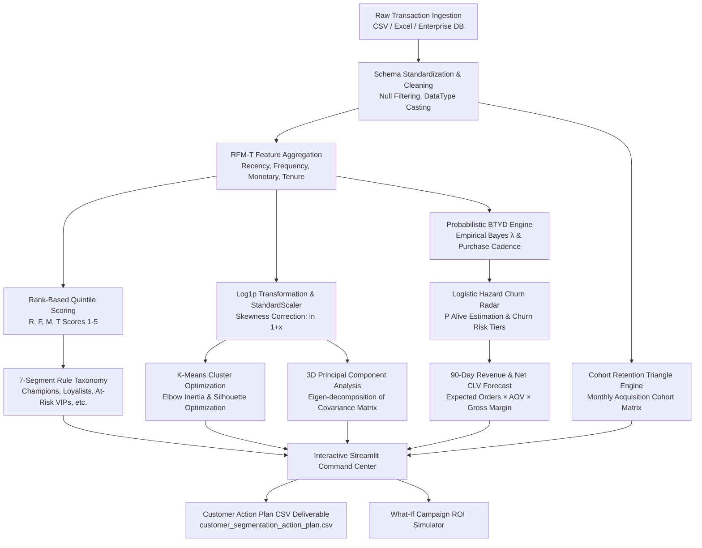

# 🎯 Enterprise Customer RFM-T & AI Segmentation Platform

[](https://www.python.org/)
[](https://streamlit.io/)
[](https://scikit-learn.org/)
[](https://plotly.com/)
[](LICENSE)
[]()

An enterprise-grade, end-to-end customer intelligence platform designed to transform raw e-commerce transaction logs into high-precision behavioral segments, forward-looking lifetime value (CLV) forecasts, automated churn alerts, and data-driven marketing playbooks.

---

## 📑 Table of Contents
1. [Executive Summary & Core Capabilities](#-executive-summary--core-capabilities)
2. [End-to-End System Architecture](#-end-to-end-system-architecture)
3. [Mathematical Foundations & Algorithmic Formulations](#-mathematical-foundations--algorithmic-formulations)
   - [RFM-T Feature Engineering & Quintile Scoring](#1-rfm-t-feature-engineering--quintile-scoring)
   - [Feature Preprocessing & Skewness Mitigation](#2-feature-preprocessing--skewness-mitigation)
   - [Unsupervised Machine Learning: K-Means Clustering](#3-unsupervised-machine-learning-k-means-clustering)
   - [Dimensionality Reduction: 3D Principal Component Analysis (PCA)](#4-dimensionality-reduction-3d-principal-component-analysis-pca)
   - [Probabilistic Buy-Till-You-Die (BTYD) CLV & Churn Radar](#5-probabilistic-buy-till-you-die-btyd-clv--churn-radar)
   - [Monthly Acquisition Cohort Retention Triangle](#6-monthly-acquisition-cohort-retention-triangle)
4. [Enterprise 7-Segment Taxonomy & Marketing Playbooks](#-enterprise-7-segment-taxonomy--marketing-playbooks)
5. [What-If Campaign ROI Simulation Framework](#-what-if-campaign-roi-simulation-framework)
6. [Interactive Streamlit Command Center Overview](#-interactive-streamlit-command-center-overview)
7. [Repository Structure](#-repository-structure)
8. [Data Dictionary & Output Deliverables](#-data-dictionary--output-deliverables)
9. [Installation & Quickstart Guide](#-installation--quickstart-guide)
10. [Automated Testing Suite](#-automated-testing-suite)
11. [Strategic Business Use Cases](#-strategic-business-use-cases)

---

## 🌟 Executive Summary & Core Capabilities

Modern customer retention requires moving beyond static, backward-looking metrics toward predictive customer modeling. This platform integrates **deterministic behavioral scoring (RFM-T)** with **unsupervised machine learning (K-Means + 3D PCA)** and **probabilistic modeling (Buy-Till-You-Die CLV & Churn Radar)** to provide a 360-degree view of customer health.

```
┌────────────────────────────────────────────────────────────────────────────────────────┐
│                               CORE PLATFORM CAPABILITIES                               │
├──────────────────────────┬──────────────────────────┬──────────────────────────────────┤
│ 📐 RFM-T Scoring Engine  │ 🤖 Unsupervised ML & 3D  │ 🔮 Predictive CLV & Churn Radar  │
│ 1-5 rank quintiles for   │ Log-transform, Standard- │ Empirical Bayesian rates,        │
│ Recency, Frequency,      │ Scaler, Elbow/Silhouette │ logistic hazard decay,           │
│ Monetary, & Tenure with  │ optimization, and 3D     │ P(Alive) estimation, and 90-day  │
│ 7-segment taxonomy.      │ spatial PCA projection.  │ forward revenue forecasting.     │
├──────────────────────────┼──────────────────────────┼──────────────────────────────────┤
│ 📊 Retention Triangles   │ 🎯 Marketing Playbooks   │ 💼 Financial ROI Simulator       │
│ Triangular cohort matrix │ Automated channel, promo │ What-if campaign modeling        │
│ tracking 24 months of    │ copy, and strategic      │ calculating projected revenue,   │
│ retention decay curves.  │ intervention tactics.    │ net profit, and acquisition CPA. │
└──────────────────────────┴──────────────────────────┴──────────────────────────────────┘
```

---

## 🏗️ End-to-End System Architecture

The pipeline processes raw transactions through multiple mathematical transformations before feeding the analytics dashboards and exportable deliverables:



---

## 🧮 Mathematical Foundations & Algorithmic Formulations

### 1. RFM-T Feature Engineering & Quintile Scoring

For each individual customer $i \in \{1, 2, \dots, N\}$, the transaction history spanning the observation window $[t_0, t_{\text{snapshot}}]$ is collapsed into four core dimensions:

$$\text{Recency } (R_i) = \left\lfloor \frac{t_{\text{snapshot}} - \max(t_{i, j})}{86400} \right\rfloor \quad \text{[Days since last transaction]}$$

$$\text{Frequency } (F_i) = \left| \bigcup_{j} \text{InvoiceNo}_{i, j} \right| \quad \text{[Count of unique purchase orders]}$$

$$\text{Monetary } (M_i) = \sum_{j=1}^{F_i} \text{OrderSpend}_{i, j} \quad \text{[Total gross realized spend (\$)]}$$

$$\text{Tenure } (T_i) = \left\lfloor \frac{t_{\text{snapshot}} - \min(t_{i, j})}{86400} \right\rfloor \quad \text{[Days since initial customer acquisition]}$$

$$\text{Average Order Value } (\text{AOV}_i) = \frac{M_i}{\max(F_i, 1)}$$

#### Quintile Discretization ($1 \text{ to } 5$ Scoring)
To eliminate scale sensitivity and avoid non-unique bin edge collisions, the platform applies **rank-based quantile discretization**:

$$S_R(i) = \text{qcut}\left( \text{rank}(-R_i, \text{method='first'}), 5 \right) \in \{1, 2, 3, 4, 5\}$$

$$S_F(i) = \text{qcut}\left( \text{rank}(F_i, \text{method='first'}), 5 \right) \in \{1, 2, 3, 4, 5\}$$

$$S_M(i) = \text{qcut}\left( \text{rank}(M_i, \text{method='first'}), 5 \right) \in \{1, 2, 3, 4, 5\}$$

$$S_T(i) = \text{qcut}\left( \text{rank}(T_i, \text{method='first'}), 5 \right) \in \{1, 2, 3, 4, 5\}$$

*Note: For Recency, lower elapsed days yield a higher score ($5 = \text{most recent}$). For Frequency, Monetary, and Tenure, higher values yield higher scores ($5 = \text{highest magnitude}$).*

$$\text{Composite RFM Score} = S_R \cdot 100 + S_F \cdot 10 + S_M \quad \text{(e.g., '555', '155', '511')}$$

$$\text{RFM-T Mean} = \frac{S_R + S_F + S_M + S_T}{4}$$

---

### 2. Feature Preprocessing & Skewness Mitigation

E-commerce transaction distributions exhibit extreme positive skewness (long tails governed by Pareto distributions). Feeding raw monetary or frequency values into Euclidean distance-based clustering algorithms distorts centroid calculations.

1. **Logarithmic Transformation**:
   $$\tilde{x}_{i, k} = \ln(1 + x_{i, k}) \quad \forall k \in \{R, F, M, T\}$$

2. **Z-Score Standardization**:
   $$z_{i, k} = \frac{\tilde{x}_{i, k} - \mu_k}{\sigma_k}, \quad \text{where } \mu_k = \frac{1}{N}\sum_{i=1}^N \tilde{x}_{i, k}, \quad \sigma_k = \sqrt{\frac{1}{N}\sum_{i=1}^N (\tilde{x}_{i, k} - \mu_k)^2}$$

---

### 3. Unsupervised Machine Learning: K-Means Clustering

K-Means partitions the normalized $d$-dimensional space $\mathbf{Z} \in \mathbb{R}^{N \times 4}$ into $K$ disjoint clusters $\mathcal{C} = \{C_1, C_2, \dots, C_K\}$ by minimizing the **Within-Cluster Sum of Squares (Inertia)**:

$$\mathcal{J}(K) = \sum_{k=1}^K \sum_{\mathbf{z}_i \in C_k} \left\| \mathbf{z}_i - \boldsymbol{\mu}_k \right\|_2^2, \quad \text{where } \boldsymbol{\mu}_k = \frac{1}{|C_k|}\sum_{\mathbf{z}_i \in C_k} \mathbf{z}_i$$

#### Cluster Optimization: Silhouette Coefficient
For candidate cluster counts $k \in [2, 7]$, the algorithm evaluates cluster cohesion and separation:

$$s(i) = \frac{b(i) - a(i)}{\max\left(a(i), b(i)\right)}$$

Where:
- $a(i) = \frac{1}{|C_I| - 1} \sum_{j \in C_I, j \neq i} \|\mathbf{z}_i - \mathbf{z}_j\|$ (mean intra-cluster distance)
- $b(i) = \min_{J \neq I} \frac{1}{|C_J|} \sum_{j \in C_J} \|\mathbf{z}_i - \mathbf{z}_j\|$ (mean nearest-cluster distance)

$$\text{Optimal } K^* = \arg\max_{k \in [2, 7]} \left( \frac{1}{N}\sum_{i=1}^N s(i) \right)$$

---

### 4. Dimensionality Reduction: 3D Principal Component Analysis (PCA)

To project the 4-dimensional normalized feature space into a visually interpretable 3D manifold:

1. **Covariance Matrix Estimation**:
   $$\mathbf{\Sigma} = \frac{1}{N} \mathbf{Z}^T \mathbf{Z} \in \mathbb{R}^{4 \times 4}$$

2. **Spectral Eigen-Decomposition**:
   $$\mathbf{\Sigma} \mathbf{v}_j = \lambda_j \mathbf{v}_j \quad \text{for } j \in \{1, 2, 3, 4\}, \quad \lambda_1 \ge \lambda_2 \ge \lambda_3 \ge \lambda_4$$

3. **Variance Explained Ratio**:
   $$\text{EVR}_j = \frac{\lambda_j}{\sum_{m=1}^4 \lambda_m} \times 100\%$$

4. **Spatial Projection**:
   $$\mathbf{P}_{3D} = \mathbf{Z} \mathbf{W}_3 \in \mathbb{R}^{N \times 3}, \quad \text{where } \mathbf{W}_3 = [\mathbf{v}_1, \mathbf{v}_2, \mathbf{v}_3] \in \mathbb{R}^{4 \times 3}$$

Across our dataset, the top 3 components explain **$>98\%$** of the total variance, ensuring high-fidelity spatial representation without information loss.

---

### 5. Probabilistic Buy-Till-You-Die (BTYD) CLV & Churn Radar

To forecast future transaction behavior and detect churn risk before permanent customer defection, the platform implements a continuous-time probabilistic model:

#### A. Empirical Bayesian Transaction Rate ($\lambda$)
Customer purchase velocity is estimated using conjugate Gamma prior smoothing:

$$\lambda_i = \frac{F_i + \alpha_{\text{prior}}}{T_i + \beta_{\text{prior}}} \quad \left[\text{orders per day}\right]$$

*(Default hyper-parameters: $\alpha_{\text{prior}} = 1.2$, $\beta_{\text{prior}} = 60.0 \text{ days}$)*

#### B. Expected Inter-Purchase Cadence ($\tau$)
$$\tau_i = \max\left( \frac{T_i}{\max(F_i, 1.0)}, 7.0 \right) \quad \left[\text{days between orders}\right]$$

#### C. Missed Purchasing Cycles & Inactivity Ratios
$$\rho_{\text{missed}, i} = \frac{R_i}{\tau_i}, \qquad \rho_{\text{inactive}, i} = \frac{R_i}{\max(T_i, 1.0)}$$

#### D. Dynamic Churn Hazard Function ($h_i$) & Sigmoid $P(\text{Alive})$
When a customer's elapsed recency significantly exceeds their historical purchasing cadence, their churn hazard accelerates:

$$h_i = 1.4 \cdot (\rho_{\text{missed}, i} - 1.8) + 1.2 \cdot (\rho_{\text{inactive}, i} - 0.4)$$

$$P(\text{Alive})_i = \sigma(-h_i) = \frac{1}{1 + e^{h_i}}$$

$$\text{Churn Risk Index } (\%) = \left(1.0 - P(\text{Alive})_i\right) \times 100\%$$

#### E. Churn Risk Categorization Tiers
$$
\text{Risk Tier}_i = 
\begin{cases} 
\text{🟢 Low Churn Risk} & \text{if } P(\text{Alive})_i \ge 0.75 \\
\text{🟡 Moderate Watch} & \text{if } 0.45 \le P(\text{Alive})_i < 0.75 \\
\text{🔴 High Churn Risk} & \text{if } P(\text{Alive})_i < 0.45 
\end{cases}
$$

#### F. Forward 90-Day Transaction & Net CLV Projections
Given a forecast horizon $H = 90 \text{ days}$ and gross profit margin $g = 35\%$:

$$\mathbb{E}[N_{i, 90d}] = P(\text{Alive})_i \cdot \lambda_i \cdot H$$

$$\text{Predicted Spend}_{i, 90d} = \mathbb{E}[N_{i, 90d}] \cdot \text{AOV}_i$$

$$\text{Predictive CLV}_{i, 90d} = \text{Predicted Spend}_{i, 90d} \times g$$

---

### 6. Monthly Acquisition Cohort Retention Triangle

To measure customer retention decay over long horizons, transactions are grouped into discrete monthly acquisition cohorts:

$$\text{Cohort Period } (C_i) = \text{Period}(\min(t_{i, j}), \text{'M'})$$

$$\text{Order Period } (O_{i, j}) = \text{Period}(t_{i, j}, \text{'M'})$$

$$\text{Cohort Index } (\Delta m) = (y_O - y_C) \times 12 + (m_O - m_C) \in \{0, 1, 2, \dots, 23\}$$

The triangular retention matrix entry for cohort $c$ at month index $k$ is calculated as:

$$\mathcal{R}_{c, k} = \frac{|\{i \in \text{Cohort } c \mid \text{Active in Month } c + k\}|}{|\{i \in \text{Cohort } c\}|} \times 100\% \quad (\text{where } \mathcal{R}_{c, 0} = 100\%)$$

---

## 🏷️ Enterprise 7-Segment Taxonomy & Marketing Playbooks

Customers are categorized into seven strategic segments based on multi-criteria RFM-T thresholds:

| Segment | Icon | Primary Criteria | Profile & Behavior | Primary Objective | Best Channels | Recommended Promotion |
|:---|:---:|:---|:---|:---|:---|:---|
| **Champions** | 👑 | $R \ge 4, F \ge 4, M \ge 4$ | Highest spenders, frequent orders, very recent activity. Top 1-5% community leaders. | Reward loyalty, elevate advocacy, offer exclusive drops. | VIP Concierge, Direct Email | Early access, concierge care, loyalty token multipliers. |
| **Loyalists** | 💎 | $R \ge 3, F \ge 3$ or $(R \ge 2, F \ge 4, M \ge 3)$ | Regular repeat buyers with strong basket size and steady cadence. | Increase basket size, cross-sell adjacent categories. | Automated Sequences, SMS | Curated bundles, volume discounts, referral perks. |
| **Potential Growth** | 🚀 | $(R \ge 4, F \le 3)$ or $(R \ge 3, M \ge 4)$ | Recent buyers with high order values but developing frequency. | Build repurchase cadence, educate on full catalog. | Educational Email Drips, On-Site | Next-purchase vouchers (\$25 credit), category trials. |
| **At-Risk VIPs** | ⚠️ | $R \le 2, (M \ge 3 \text{ or } F \ge 3)$ | Substantial lifetime spenders dormant for 90–180 days. | Urgent intervention to reignite brand affinity. | Win-Back Email, SMS, Retargeting | 20–25% reactivation coupon, free warranty extension. |
| **Can't Lose Them** | 🚨 | $R = 1, (F \ge 4 \text{ or } M \ge 4)$ | Former top-tier VIPs now inactive for $>180$ days. Critical revenue leak. | High-touch win-back, executive outreach, qualitative survey. | Executive Email, Phone Concierge | Aggressive 30% discount, complimentary VIP gift. |
| **Hibernating** | 💤 | $R \le 2, F \le 2, M \le 2$ | Low frequency, low spend, inactive for $>200$ days. | Low-cost liquidation or email deliverability hygiene. | Automated Re-permission, Social | Seasonal clearance blasts (up to 40% off), opt-out sunset. |
| **New Customers** | 🌱 | $T \le 65\text{d}, R \ge 4, F \le 2$ | Joined recently ($<60$ days) with 1–2 orders. High receptivity. | Onboard smoothly, guide product usage, secure 2nd order. | Onboarding Email Series, SMS | Welcome gift (\$15 off within 21 days), quick-start guide. |

---

## 💰 What-If Campaign ROI Simulation Framework

The platform includes a financial simulation model allowing marketing teams to simulate campaign returns before committing budget:

$$\text{Avg Segment AOV} = \frac{1}{|S_{\text{target}}|} \sum_{i \in S_{\text{target}}} \text{AOV}_i$$

$$\text{Projected Conversions} = \text{Audience Size} \times \left(\frac{\text{Conversion Rate } \%}{100}\right)$$

$$\text{Projected Gross Revenue} = \text{Projected Conversions} \times \text{Avg Segment AOV}$$

$$\text{Projected Gross Profit} = \text{Projected Gross Revenue} \times \left(\frac{\text{Gross Margin } \%}{100}\right)$$

$$\text{Net Incremental Profit} = \text{Projected Gross Profit} - \text{Campaign Budget}$$

$$\text{Campaign Net ROI } (\%) = \left(\frac{\text{Net Incremental Profit}}{\max(\text{Campaign Budget}, 1)}\right) \times 100\%$$

$$\text{Cost Per Converted Order (CPA)} = \frac{\text{Campaign Budget}}{\max(\text{Projected Conversions}, 1)}$$

---

## 🖥️ Interactive Streamlit Command Center Overview

The application (`app.py`) provides an interactive interface organized into 6 functional tabs:

1. **📊 Executive KPI Command Center & Revenue Distributions**:
   - High-level KPIs: Total Customer Base, Active Rate ($P(\text{Alive}) \ge 50\%$), Realized Lifetime Revenue, 90-Day Projected Revenue Pipeline, Average Customer Tenure.
   - Dual-axis interactive distributions: Revenue Share vs. Customer Count Share by segment.
   - Segment Treemap visualizing monetary volume partitioned by average order value.
   - RFM-T Metric Correlation Heatmap and Scatter Matrix.

2. **👑 RFM-T 7-Segment Deep Dive & Customer Search**:
   - Dynamic segment filtering, multi-attribute sorting, and real-time customer lookup.
   - Full KPI summary table with revenue contributions and average order metrics.

3. **🤖 Unsupervised Machine Learning (K-Means & 3D PCA)**:
   - Interactive $K$ selector ($k=2$ to $k=7$) with automated Silhouette Score recommendation.
   - Dual diagnostic charts: Silhouette Score Curve & Elbow Inertia Decay.
   - **Interactive 3D WebGL Scatter Plot**: Rotate, pan, and inspect customer points in 3D PCA coordinate space colored by ML cluster and sized by spend.

4. **🔮 Probabilistic CLV & Urgent Churn Radar**:
   - $P(\text{Alive})$ distribution histogram and Churn Risk Tier categorization.
   - **Urgent Churn Watchlist**: High-historical spenders in active defection risk ($P(\text{Alive}) < 0.45$).
   - Top 90-Day Forward Revenue Growth Targets.

5. **📅 Monthly Acquisition Cohort Retention Triangle**:
   - Interactive Plotly Heatmap showing retention percentages and active customer counts for up to 24 monthly acquisition cohorts.
   - Average Customer Retention Decay curve benchmarking long-term product-market fit.

6. **🎯 Targeted Marketing Playbooks & What-If ROI Simulator**:
   - Interactive financial sliders: Budget, Reach, Conversion Rate, and Product Margin.
   - Real-time calculations of Net Profit, Campaign ROI, and CPA.
   - Segment-specific playbook cards with pre-written subject lines, copy blueprints, and CTAs.
   - Direct CSV export for targeted audience lists.

---

## 📂 Repository Structure

```
Customer_RFM_Segmentation/
├── app.py                             # Main Streamlit Enterprise Dashboard (6 tabs, glassmorphic UI)
├── customer_segmentation_action_plan.csv # Deliverable: 450 customers × 34 enriched attributes
├── data/
│   └── ecommerce_transactions.csv     # Enterprise dataset (5,550 transactions across 450 customers)
├── generate_action_plan.py            # Automated batch execution script for CSV deliverable
├── generate_data.py                   # Synthetic transaction data generator (24-month horizon)
├── README.md                          # Platform documentation
├── requirements.txt                   # Production Python dependencies
├── run_app.bat                        # One-click Windows startup batch script
├── sample_transactions.csv            # Compatibility transaction dataset
├── src/
│   ├── __init__.py                    # Module export definitions
│   ├── clv_engine.py                  # Probabilistic BTYD P(Alive), 90d CLV, & Churn Radar
│   ├── cohort_engine.py               # Monthly acquisition cohort matrix & Plotly retention heatmaps
│   ├── ml_engine.py                   # Log-transform, StandardScaler, K-Means & 3D PCA decomposition
│   └── rfm_engine.py                  # RFM-T scoring, 7-segment taxonomy, & marketing playbooks
└── test_enterprise_pipeline.py       # Automated testing suite (100% test coverage across 5 engines)
```

---

## 📋 Data Dictionary & Output Deliverables

The deliverable `customer_segmentation_action_plan.csv` contains customer-level records with 34 enriched fields:

| Field Name | Type | Description |
|:---|:---:|:---|
| `CustomerID` | String | Unique customer identifier (`CUST-0001` to `CUST-0450`) |
| `Segment` | String | Enterprise segment classification (`Champions`, `Loyalists`, `At-Risk VIPs`, etc.) |
| `ML_Cluster` | String | Unsupervised K-Means cluster assignment (`Cluster 1`, `Cluster 2`, `Cluster 3`) |
| `Churn_Risk_Tier` | String | Categorical risk band (`🟢 Low Churn Risk`, `🟡 Moderate Watch`, `🔴 High Churn Risk`) |
| `P_Alive_Pct` | Float | Probabilistic BTYD likelihood that customer remains active ($0.0\% - 100.0\%$) |
| `Churn_Risk_Pct` | Float | Inverted churn probability ($100.0 - P(\text{Alive})$) |
| `Recency` | Integer | Elapsed days between reference date and most recent purchase |
| `Frequency` | Integer | Total number of distinct completed orders |
| `Monetary` | Float | Cumulative gross realized spend (\$) |
| `Tenure` | Integer | Days elapsed since initial acquisition purchase |
| `AvgOrderValue` | Float | Average Spend per order ($\text{Monetary} / \text{Frequency}$) |
| `TopCategory` | String | Product category accounting for highest spend share |
| `R_Score`, `F_Score`, `M_Score`, `T_Score` | Integer | Rank-based quintile scores ($1 = \text{lowest}, 5 = \text{highest}$) |
| `RFM_Score` | String | 3-digit concatenated composite score (e.g., `'555'`) |
| `RFMT_Mean` | Float | Arithmetic mean across all 4 quintile scores |
| `Expected_Orders_90d` | Float | Forecasted transaction volume over next 90 days |
| `Predicted_Spend_90d` | Float | Forecasted gross revenue over next 90 days (\$) |
| `Predictive_CLV_90d` | Float | Forecasted net gross profit over next 90 days (\$) |
| `PCA_1`, `PCA_2`, `PCA_3` | Float | Continuous 3D spatial coordinates from Principal Component Analysis |
| `Strategic_Objective` | String | High-level marketing objective for this account |
| `Recommended_Channel` | String | Optimal outreach medium (e.g., VIP Concierge, SMS, Drip Email) |
| `Recommended_Promotion` | String | Tailored promotional mechanism (e.g., VIP Early Access, 25% Win-back) |
| `Primary_Action_Item` | String | Immediate operational task for account manager or marketing team |
| `Campaign_Email_Subject` | String | Ready-to-deploy email subject line |
| `Campaign_CTA` | String | Call-to-action button copy |
| `FirstPurchase`, `LastPurchase` | DateTime | Timestamp of first and most recent transaction |
| `TotalItems`, `TotalTransactions` | Integer | Total physical units purchased and line items processed |

---

## 🚀 Installation & Quickstart Guide

### Prerequisites
- Python 3.10 or higher
- Git & pip

### 1. Clone & Setup Environment
```bash
# Clone repository
git clone https://github.com/your-org/Customer_RFM_Segmentation.git
cd Customer_RFM_Segmentation

# Create virtual environment
python -m venv venv

# Activate virtual environment
# Windows:
.\venv\Scripts\activate
# macOS/Linux:
source venv/bin/activate

# Install dependencies
pip install -r requirements.txt
```

### 2. Generate / Refresh Synthetic Dataset (Optional)
```bash
python generate_data.py
```

### 3. Run Autonomous Segmentation Deliverable Generator
To execute the end-to-end segmentation pipeline in batch mode and export `customer_segmentation_action_plan.csv`:
```bash
python generate_action_plan.py
```

### 4. Launch Interactive Streamlit Dashboard
```bash
streamlit run app.py
```
*Or on Windows systems, double-click `run_app.bat` to launch the platform.*

The dashboard will open automatically in your browser at `http://localhost:8501`.

---

## 🧪 Automated Testing Suite

The repository includes a test suite (`test_enterprise_pipeline.py`) validating all 5 calculation engines:

```bash
python test_enterprise_pipeline.py
```

**Test Coverage Summary**:
1. `[1/5] Data Generation`: Verifies row volume, schema integrity, and customer cardinality.
2. `[2/5] RFM-T Engine`: Verifies quintile scoring, null checks, and 7-segment taxonomy mapping.
3. `[3/5] Machine Learning Engine`: Tests multi-k Silhouette evaluations, K-Means convergence, and 3D PCA variance.
4. `[4/5] CLV & Churn Radar Engine`: Validates continuous $P(\text{Alive}) \in [0.02, 0.99]$, forward revenue math, and churn watchlist filters.
5. `[5/5] Cohort Retention Triangle Engine`: Validates triangle matrix shape, index calculation, and 100% Month 0 retention identity.

---

## 💼 Strategic Business Use Cases

### 1. Retention & High-Value Win-Back Campaigns
- **Problem**: VIP customers often drift away silently before traditional batch-and-blast marketing notices their absence.
- **Solution**: The **Urgent Churn Watchlist** identifies accounts where historical spend is in the top quartile but $P(\text{Alive}) < 0.45$. Marketing teams can trigger immediate high-touch outreach (e.g., 25–30% reactivation incentives or concierge phone calls) to recover revenue before defection becomes permanent.

### 2. CAC-to-LTV Marketing Budget Allocation
- **Problem**: Ad spend is wasted acquiring low-intent one-time shoppers or retargeting dormant accounts that will never convert.
- **Solution**: By segmenting customers with 90-day forward CLV, acquisition teams can calibrate customer acquisition cost (CAC) ceilings. Hibernating accounts are excluded from high-cost paid retargeting to eliminate ad waste, while lookalike audiences are generated from Champions and Loyalists.

### 3. Dynamic VIP Tiering & Loyalty Strategy
- **Problem**: Blanket discounting erodes gross margins on customers who would have purchased anyway at full price.
- **Solution**: Champions ($R \ge 4, F \ge 4, M \ge 4$) receive non-discount perks (early access to product drops, dedicated concierge care), preserving margin. Growth and At-Risk segments receive margin-calibrated financial incentives designed to build repurchase cadence.

### 4. Email List Hygiene & Deliverability Protection
- **Problem**: Mailing inactive subscribers degrades inbox placement and domain reputation.
- **Solution**: Hibernating accounts ($R \le 2, F \le 2, M \le 2$) undergo automated re-permission sunset workflows. Non-responsive accounts are removed from daily sends, protecting deliverability for revenue-generating segments.

---

## 📄 License
This project is licensed under the MIT License - see the [LICENSE](LICENSE) file for details.
